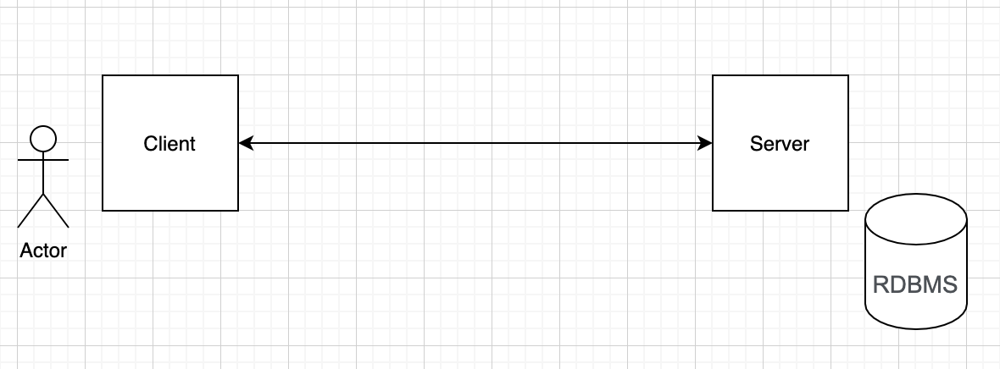
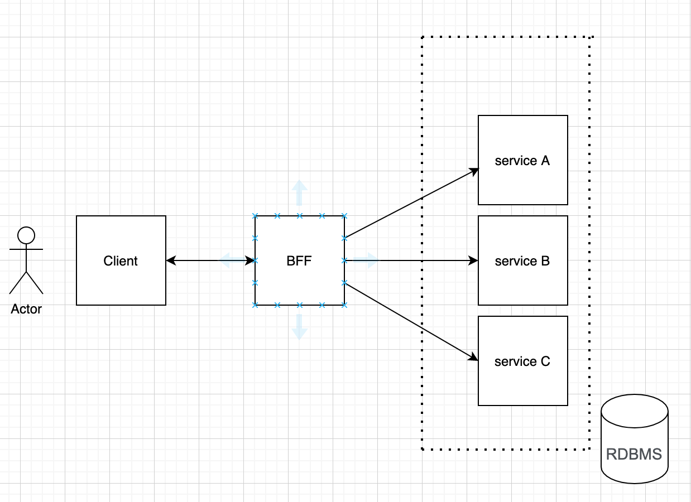

# Preguntas

Responde estas preguntas. Máximo 150 palabras por pregunta.

## 1. Cuéntanos qué piezas de software crees que sea necesario desarrollar para el prototipo funcional y cómo se relacionan estas. Llamamos pieza de software a cada aplicación (web, móvil o de escritorio), cada API, cada proceso batch que se puede desplegar de forma independiente. Apóyate con un diagrama si crees necesario.

Un MVP de este producto podría considerar los siguientes componentes:

- Una aplicación que haga de cliente, puede ser un sitio web responsivo, no necesitamos una app mobile, eso sería demasíado esfuerzo.
- Un servicio REST o GraphQL para manejar la lógica de negocio.
- Una base de datos, por el momento, una del tipo relacional debería bastar.

La forma en que estos componentes se relacionan es como se muestra a continuación.

---

## 2. Cuéntanos sobre el tipo de arquitectura que elegiste para la pregunta (1). ¿Monolítica? ¿Micro-servicios? ¿Algún intermedio? ¿Otra? Comenta en qué te basaste para tomar esta decisión

Al ser un prototipo, yo no pondría mucho esfuerzo en crear una compleja arquitectura de microservicios, empezaría con una arquitectura simple del tipo cliente/servidor.

La motivación principal de esta decisión es la necesidad de salir pronto al mercado y testear con usuarios si realmente es esto lo que ellos necesitan y quieren usar.

Al empezar de esta forma, es fácil escalar (ya pasada la etapa de prototipado) a una arquitectura de microservicios, que para mi sería la evolución natural de este producto, bastaría con empezar a extender funcionalidades en diferentes microservicios y poner un BFF (backend for frontend) entre la single page application y las diferentes APIs.

Además, empezar simple pero con la mentalidad de escalar a microservicios nos permitiría extender nuestra solución con diferentes soluciones, (app mobile, web site, APIs as a service, etc)

Al ser una aplicación que espera recibir muchos requests, es probable que se tenga que evaluar una arquitectura basada en eventos, de esta forma podemos administrar de manera async esas peticiones, (por ejemplo el envio de notificaciones a los clientes y repartidores puede ser basada en eventos).

---

## 3. Describe la metodología de trabajo que usarías para el desarrollo. Puede ser alguna metodología conocida (Scrum, XP, RUP), una adaptación, o una mezcla entre varias metodologías. Lo que sea que tu experiencia te haya mostrado que funciona. Cuéntanos por qué crees que esta forma es adecuada para nuestro problema.

Mi sugerencia es usar un framework de trabajo un poco mas rígido, como podría ser Scrum, con iteraciones fijas de cada 2 semanas, esto debido a la experiencia del equipo, al ser un equipo nuevo, no acostumbrado a trabajar juntos, podría ser contraproducente comenzar trabajando con metodologías más flexibles.

Sin desmedro de lo anterior, **una vez el equipo esté mas afiatado**, recomendaría utilizar Kanban o XP, considero que un **flujo de trabajo continuo**, sin sprints, es la mejor solución que he experimentado, sin embargo, esto debe ser aplicado en equipos bien disciplinados.

Independiente de la metodología, para mi la clave es la adaptación y la flexibilidad que tenga el equipo ante el cambio, podemos empezar con X y terminar con Z, mientras sea dentro de un proceso de mejora continua y un acuerdo del equipo, es beneficioso para el producto.

---

## 4. Describe el workflow que usarías para colaborar usando Git. Al igual que con (3), puedes usar algo conocido o una adaptación.

Me gusta [Trunk Based Development](https://trunkbaseddevelopment.com/), pero al igual que con la metodología de trabajo, la práctica a seguir para la colaboración con una herramienta de control de versiones va a depender de varios factores, uno de ellos es sin duda **la madurez del equipo**.

Si poseemos un equipo maduro, con buenas prácticas de desarrollo (TDD, pairing programming, CI/CD, etc) sin duda recomendaría TBD, sin embargo, si eso no es así, otra buena opción es **Short-Lived Feature Branches**. es posible crear branches los cuales deben ser **unidos al branch principal regularmente**, el objetivo principal es que antes de integrar los cambios, estos pasen por una revisión por otros miembros del equipo, de esta forma aseguramos la calidad del código escrito.

Lo que no recomendaría prácticamente nunca, es crear branches que no se integren al trunk al menos una vez al día, si se quiere hacer integración continua y entrega continua, es muy importante hacer merge regularmente y esta práctica no lo permite.

---

## 5. ¿Crees que sea necesario agregar algún integrante extra al equipo durante el desarrollo del prototipo? ¿Cuál sería su rol? ¿Crees que sería necesario agregar nuevos integrantes después de la fase de prototipo? ¿Cuándo y por qué?

Nunca he trabajado con un "Impact Lead", suena como un business analyst o Product Owner, si es así creo que en el equipo durante la fase de prototipo hace falta un UX/XD esto con el fin de ayudarnos a crear el producto correcto, me gustaría que esta etapa de prototipado se basara en los principios Lean de construir, medir y aprender y creo que una persona con ese rol nos ayudaría bastante.

Ya durante el proceso de desarrollo mismo, posterior al prototipado, mantendría a la persona UX/XD y agregaría a un especialista en infraestructura, si bien el software engineer probablemente tenga capabilities suficientes para desplegar la aplicación, hay conceptos mas específicos que pudiesen necesitar la ayuda de algún experto en infraestructura.

---

## 6. ¿Qué otras consideraciones tendrías para hacer el proceso de desarrollo robusto y eficiente?

Para que el proceso de construcción del producto resulte exitoso, sugeriría poner foco en las prácticas de desarrollo, recomiendo automatizar tests, usar **Test Driven Development**, tener **pipelines automatizados** que nos permitan realizar **Continuos Integration**, **Continuos Delivery** y por qué no en el futuro llegar a tener **Continuos Deployment**.

Es importante tener acuerdos construidos por todo el equipo, evitar silos de conocimiento, tener un ownership compartido del producto, hacer validaciones de seguridad de manera regular.

Respecto al proyecto mismo, es vital gestionar **los riesgos, supuestos, problemas y dependencias (RAID)**, la **deuda técnica** debe ser evitada y si no es posible debe ser mapeada para ser pagada en el futuro.

Sin duda los puntos mencionados en los párrafos previos son importantes, pero para el mayor es el Feedback, el equipo debe tener una **cultura de feedback** alineada a los valores de la compañia con el fin de alinear expectativas y mejorar continuamente.

:)
