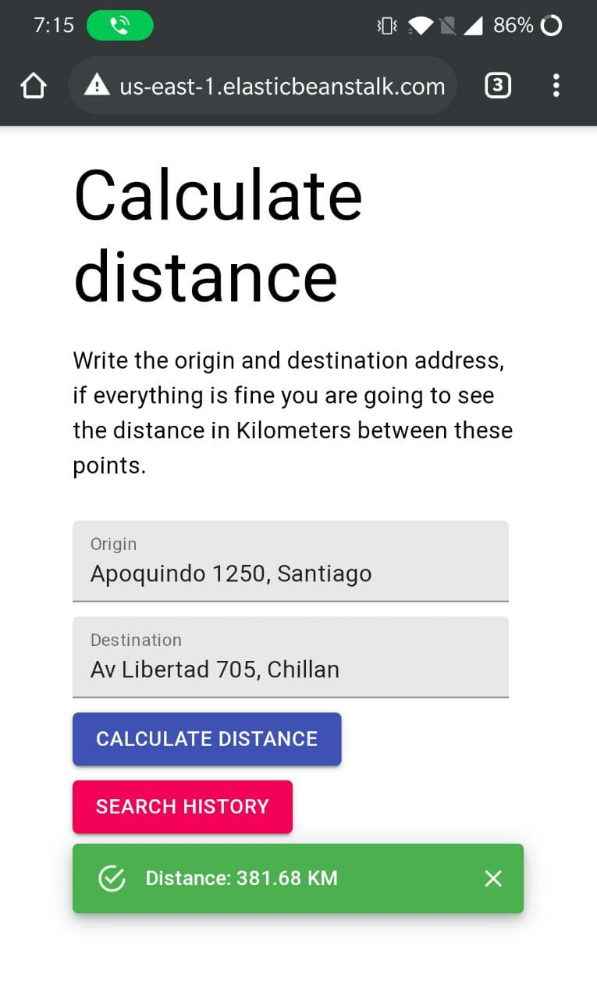

# Delivery app



This app allow to calculate the distance given two points.

## How to use

Currently the app is hosted in **AWS Elastic Beanstalk** in the following url:

http://deliveryappfront-env.eba-exuji4d9.us-east-1.elasticbeanstalk.com/

## Run project locally

If you want to run the client, server application and storage in your computer you need **Docker**, to do it just run the following command in the root folder:

```
docker-compose up
```

then go to: http://localhost:8080/

enjoy :)

---

## Project arquitecture

Delivery app is writen using Javascript as a primary language, with some dependencies of some python modules, following a clasic client-server arquitecture with an web client application using React and a REST backend service using Fastify.

This is the list of the main dependencies used in this project:

### Client side application:

- [React](https://es.reactjs.org/)
- [MaterialUI](https://material-ui.com/)
- [React Router](https://reactrouter.com/web/guides/quick-start)

### Server side application:

- [Fastify](https://www.fastify.io/)

### Storage

- [SQLite](https://www.sqlite.org/index.html)

---

## How to colaborate in the project

Each folder (frontend and backend) includes a specific README file with instructions to follow in order to start development.
